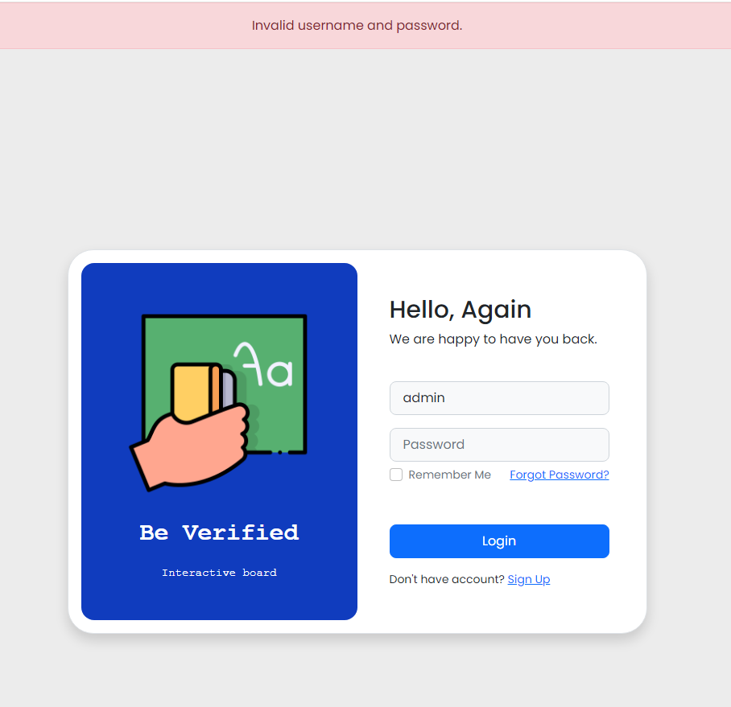
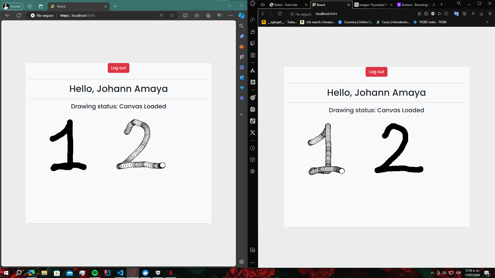

# Web Security Application

The project is a simple web application built with Spring Boot and Spring Security. It demonstrates how to secure web applications using Spring Security, featuring a custom login page and an in-memory user details service. The application ensures that only authenticated users can access certain pages while allowing unrestricted access to the login and index pages. Additionally, it provides functionality for a shared drawing board, enabling users to collaborate in real-time within a secure environment.

## Features

- **Secure Login**: User authentication with a custom login page.
- **In-memory Users**: Two users (`user` and `admin`) are predefined in the application.
- **Access Control**: Restricts access to authenticated users for all pages except the index and login pages.

## Getting Started

### Prerequisites

- **Java**: Ensure Java Development Kit (JDK) version 17 is installed.
- **Maven**: Automate and standardize the software build lifecycle.
- **Git**: Decentralized Configuration Manager.

### Installing

1. **Maven**

   - Download Maven from [here](http://maven.apache.org/download.html).
   - Follow the installation instructions [here](http://maven.apache.org/download.html#Installation).

2. **Git**

   - Download Git from [here](https://git-scm.com/downloads).
   - Follow the installation instructions [here](https://git-scm.com/book/en/v2/Getting-Started-Installing-Git).

### Clone the Repository

You can clone the project repository using the following command:

```bash
git clone https://github.com/XxELIngexX/SPTI-Lab
```

### Run the Application

1. Open a terminal and navigate to the folder where you cloned the repository.
2. Use the following command to remove files generated in previous builds, compile the code, and package the project into a JAR file:

   ```bash
   mvn clean package
   ```

3. Make sure to set the following environment variables before running the project:

   ```bash
   export USER_PASSWORD=N3wS3cureP@ssword!
   export ADMIN_PASSWORD=N3wAdm1nP@ssword!
   export KEYSTORE_PASSWORD=pMsr8*1pYnI~e\s7M95?*Pf5tu55m{bQ%p
   set TRUSTSTORE_PASSWORD=pMsr8*1pYnI~e\s7M95?*Pf5tu55m{bQ%p
   ```

   On Windows, use:

   ```bash
   set USER_PASSWORD=N3wS3cureP@ssword!
   set ADMIN_PASSWORD=N3wAdm1nP@ssword!
   set KEYSTORE_PASSWORD=pMsr8*1pYnI~e\s7M95?*Pf5tu55m{bQ%p
   set TRUSTSTORE_PASSWORD=pMsr8*1pYnI~e\s7M95?*Pf5tu55m{bQ%p
   ```

4. Now, run the project using the following command:

   ```bash
   mvn spring-boot:run
   docker run --name some-redis -p 45000:6379 -d redis
   ```



5. Open a browser and go to the following link to access the login page:

   [Login Page](http://localhost:8444/login)



## Project Structure

### Backend (Spring Boot)

#### `BBAppStarter`

- **Description**: Main application class for the Spring Boot application.
- **Purpose**: Defines the primary entry point of the Spring Boot application using the `@SpringBootApplication` annotation.

#### `BBConfigurator`

- **Description**: Configuration class for the WebSocket server endpoint and scheduling.
- **Purpose**: Configures the WebSocket server endpoint using `@Configuration` and enables scheduling using `@EnableScheduling`.

#### `BBEndpoint`

- **Description**: WebSocket endpoint for handling drawing actions via WebSocket protocol.
- **Purpose**: Manages WebSocket sessions, message processing, and error handling, enabling real-time communication between clients and the server.

#### `DrawingServiceController`

- **Description**: REST controller for handling status requests.
- **Purpose**: Provides a REST endpoint `/status` returning the server status in JSON format, including the current date and time.

#### `MvcConfig`

- **Description**: MVC configuration class for registering view controllers.
- **Purpose**: Configures view controllers to handle specific URLs (`/`, `/index`, `/login`, `/error`) and assigns corresponding view names.

#### `TicketController`

- **Description**: REST controller class for handling ticket generation requests.
- **Purpose**: Provides a REST endpoint `/ticket/generate` generating a new ticket for WebSocket authorization based on the user ID.

#### `TicketService`

- **Description**: Service managing the generation, validation, and removal of tickets.
- **Purpose**: Manages tickets stored in memory, verifying their validity and removing them upon expiration.

#### `WebSecurityConfig`

- **Description**: Configuration class for web security using Spring Security.
- **Purpose**: Configures HTTP security policies, user authentication, and secure access to pages using custom login forms and an in-memory user details service.

## Architectural Design

### Data Flow

1. **Initialization**:
   - The `WebSecurityConfig` class initializes the security configuration.
   - Defines in-memory users with roles.

2. **Login**:
   - Users access the login page at `/login`.
   - Users authenticate with predefined usernames and passwords.

3. **Access Control**:
   - Authenticated users can access secured pages.
   - Unauthenticated users are redirected to the login page.

## Built with

- **Spring Security** - Framework for securing Spring-based applications.
- [Spring Boot](https://spring.io/projects/spring-boot) - Backend framework.
- [Maven](https://maven.apache.org/) - Dependency management.

## Authors

- Johann Amaya Lopez - [@JohannBulls](https://github.com/JohannBulls)

## License

This project is licensed under the GNU License - see the LICENSE.txt file for details.